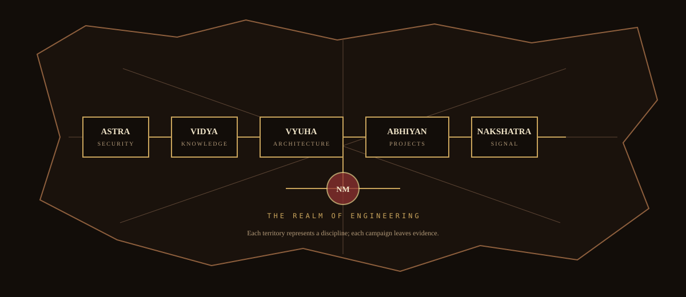
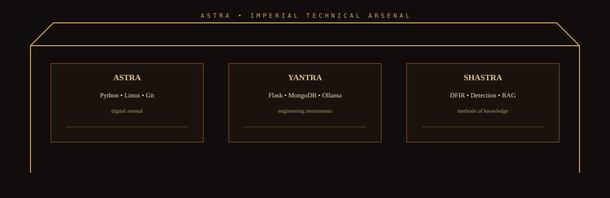
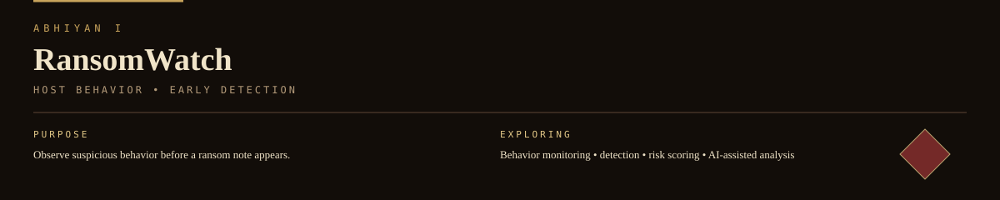
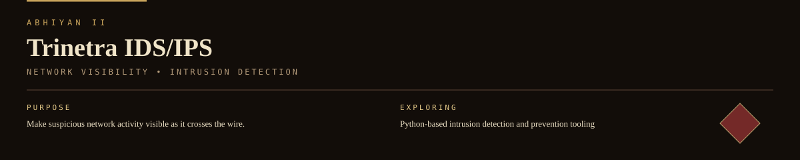
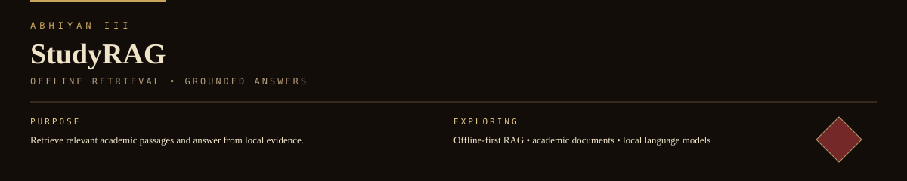
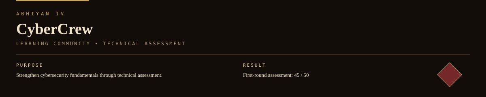
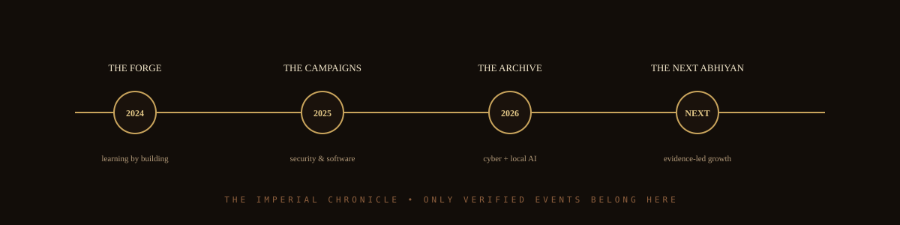
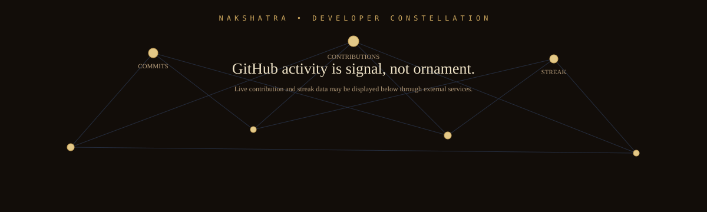

<!--
THE IMPERIAL ARCHIVE OF NARASIMHAMURTHY
Profile repository: NARASIMHAMURTHY4616/NARASIMHAMURTHY4616
All visual assets are self-hosted in ./assets/.
The terminology is an original Mahabharata-inspired world-building layer over real engineering work.
-->

<div align="center">
  
</div>

<p align="center">
  <code>RAJYA</code> · <code>SABHA</code> · <code>ASTRA</code> · <code>VYUHA</code> · <code>ABHIYAN</code> · <code>NAKSHATRA</code>
</p>

<div align="center">
  
</div>

## I · RAJYA — THE ARCHIVE

<table>
<tr>
<td width="30%" valign="top">

**SUBJECT**

Narasimhamurthy

**POSITION**

B.Tech · Year III  
Cyber Security Engineering

**HANDLE**

`@NARASIMHAMURTHY4616`

**DISCIPLINE**

DFIR → security engineering

</td>
<td width="70%" valign="top">

I learn by taking systems apart: watching how software behaves, following the anomaly, then writing Python to make the observation repeatable.

My work currently moves across suspicious behavior on hosts and networks, local AI that answers from documents instead of guessing, cybersecurity learning, DFIR/offensive-security study, and practical student software.

**DIRECTION**

`DFIR` · `security engineering` · `threat detection` · `offensive security` · `Python automation` · `AI-assisted defense`

</td>
</tr>
</table>

---

## II · BHU-MANDALA — THE REALM

The profile is organized as an imperial map rather than a collection of cards. Each territory has a technical meaning.

<div align="center">
  
</div>

| Imperial term | Engineering meaning |
|---|---|
| **Rajya** | The complete engineering world |
| **Sabha** | Technical disciplines and knowledge |
| **Astra** | Tools and security capabilities |
| **Vyuha** | System architecture and strategic structure |
| **Abhiyan** | Projects and engineering campaigns |
| **Nakshatra** | GitHub activity and developer signal |
| **Granth** | Learning and knowledge |
| **Sutra** | Engineering principles |

---

## III · SABHA — THE COUNCIL OF DISCIPLINES

<div align="center">
  
</div>

The council currently convenes around:

**CYBERSECURITY**  
Threat detection · network security · DFIR · offensive security

**PYTHON & SYSTEMS**  
Python · Linux · Git · automation

**LOCAL AI**  
RAG · Ollama · grounded document retrieval

**WEB & DATA**  
Flask · MongoDB · HTML · CSS · MySQL · SQLite

---

## IV · ASTRA — THE DIGITAL ARSENAL

<div align="center">
  
</div>

I don't use a technology because it looks impressive on a list. I want to know what it can observe, automate, break, explain, or defend.

**Applied in projects:** Python, Flask, MongoDB, Ollama, RAG, threat detection, network security.

**In the toolkit:** C, C++, Java, JavaScript, Bash, Linux, Ubuntu, Git, GitHub, Docker, HTML, CSS, MySQL, SQLite.

**Studying / exploring:** DFIR, offensive security, security automation, AI-assisted security.

---

## V · VYUHA — THE STRATEGIC FORMATION

The engineering pattern behind my work:

```text
                    FIELD
                      │
                 OBSERVATION
                      │
                 EVIDENCE
                      │
             ┌────────┴────────┐
             │                 │
          ANALYSIS          CONTEXT
             │                 │
             └────────┬────────┘
                      │
                 HYPOTHESIS
                      │
                 IMPLEMENT
                      │
                 TEST / BREAK
                      │
                 IMPROVE
                      │
                  REPEAT
```

The important part is not the diagram itself. It is the habit: **evidence before assumption, experimentation before confidence, iteration before perfection.**

---

## VI · ABHIYAN — ENGINEERING CAMPAIGNS

These are student projects and experiments, not production systems.

### ABHIYAN I · RANSOMWATCH

<div align="center">
  
</div>

**Problem.** Ransomware shows up in behavior before it shows up as a ransom note.

**Exploring.** AI-based early ransomware behavior detection and analysis: suspicious behavior monitoring, detection, risk scoring, analysis, and AI-assisted explanations.

**Status:** `student project · experimental`

---

### ABHIYAN II · TRINETRA IDS/IPS

<div align="center">
  
</div>

**Problem.** A network is only defensible if its activity is visible.

**Exploring.** Python-based network intrusion detection and prevention, focused on spotting suspicious activity as it crosses the wire.

**Status:** `student project · experimental`

---

### ABHIYAN III · STUDYRAG

<div align="center">
  
</div>

**Problem.** Academic documents are searchable but rarely answerable.

**Exploring.** An offline-first local AI study assistant using retrieval-augmented generation over academic documents with local language models.

**Status:** `student project · experimental`

---

### ABHIYAN IV · CYBERCREW

<div align="center">
  
</div>

**Problem.** Security tooling rests on fundamentals.

**Exploring.** Cybersecurity fundamentals, operating systems, networking, filesystems, threats, malware, and Python.

**Result:** **45/50** in the first-round assessment.

---

### ABHIYAN V · STUDENT SYSTEMS

Attendance and marks management web applications built with Python, Flask, and MongoDB.

**Status:** `student projects`

---

## VII · CHAKRAVYUHA — SYSTEM THINKING

I am interested in systems where several layers interact:

```text
┌─────────────────────────────────────────────────────┐
│                    USER / OPERATOR                  │
├─────────────────────────────────────────────────────┤
│                  APPLICATION LAYER                  │
├─────────────────────────────────────────────────────┤
│              DATA / MODEL / RETRIEVAL               │
├─────────────────────────────────────────────────────┤
│             HOST / NETWORK / OS SIGNALS             │
├─────────────────────────────────────────────────────┤
│                    EVIDENCE                          │
└─────────────────────────────────────────────────────┘
```

The security question is always:

> **What happened, what evidence proves it, and what can be done next?**

---

## VIII · KRIYA — THE ENGINEERING LOOP

<div align="center">
  
</div>

<div align="center">
  
</div>

For live GitHub statistics, external widgets may be used below. They are intentionally separated from the self-hosted archive artwork.

<table>
<tr>
<td width="50%" align="center">

</td>
<td width="50%" align="center">

</td>
</tr>
</table>

---

## IX · GRANTHA — THE KNOWLEDGE CODEX

Current areas of study and exploration:

- Digital forensics and incident response
- Offensive security
- Threat detection
- Security automation
- Python engineering
- Local AI / RAG systems
- Systems and networking

No percentage bars. No invented proficiency scores. The archive records what is actually being learned and built.

---

## X · SUTRA — ENGINEERING DHARMA

**SUTRA I**  
Observe before assuming.

**SUTRA II**  
Evidence before explanation.

**SUTRA III**  
Understand the system before automating it.

**SUTRA IV**  
Break what you build so you can understand what survives.

**SUTRA V**  
A useful tool should make the next investigation easier.

---

## XI · SAMVADA — CONTACT

```text
$ open --archive NARASIMHAMURTHY

  github    github.com/NARASIMHAMURTHY4616
  linkedin  linkedin.com/in/ballanarasimhamurthy

> transmission complete
```

<div align="center">
  <a href="https://github.com/NARASIMHAMURTHY4616"><code>GITHUB</code></a>
  &nbsp; · &nbsp;
  <a href="https://www.linkedin.com/in/ballanarasimhamurthy/"><code>LINKEDIN</code></a>
</div>

<div align="center">
  
</div>

<p align="center">
  <sub>AN ORIGINAL MAHABHARATA-INSPIRED VISUAL LANGUAGE FOR A MODERN ENGINEERING ARCHIVE.</sub>
</p>
